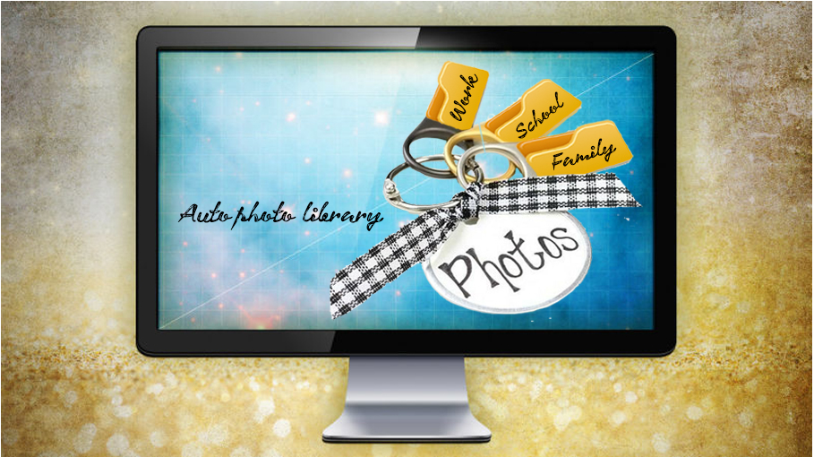

# Auto Photo Library

  

Turn your digital photos into an organized Photo Gallery. Upload your folder of pictures to the Auto Photo Library, and with the click of a button, the pictures will be organized into categories such as  Beaches, Landmarks, Nature, Animals, Electronics, and Fashion.

## Project Team
* Debbie Chan
* Swati Giri
* Rupali Shah

## Dataset
* [ImageNet](http://www.image-net.org/)
* [GoogleAPI OpenImages](https://storage.googleapis.com/openimages/web/download.html)

## Testing Platform
Floydhub

## Architecture
* Classifier - Convolutional Neural Network (CNN)
* Library - Tensorflow,  Keras
* Weights - ImageNet
* Pre-trained models - VGG19, Xception
 
## Analysis
* Confusion Matrix 
* Model Accuracy Comparison  

## Results
* Flask to display app as webpages
* Heroku to host the app

 

